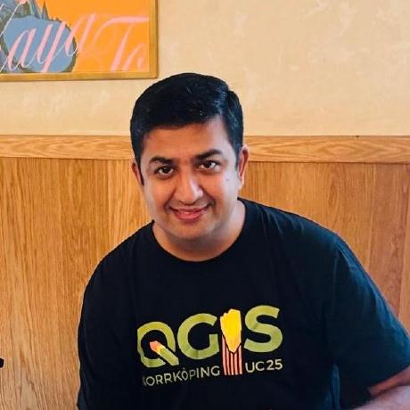
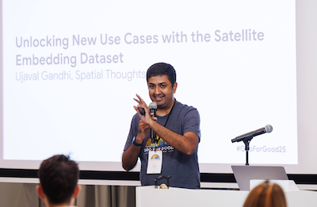

---
hide:
  - toc
  - navigation
---
<!--
CHECKLIST FOR THIS PAGE:
- [ ] Replace [YOUR NAME] with your full name (3 places)
- [ ] Replace [YOUR JOB TITLE] with your current or target role
- [ ] Replace [YOUR TAGLINE] with a short phrase describing your focus
- [ ] Rewrite the About Me paragraph with your own words
- [ ] Replace assets/images/profile.png with your actual photo (keep the filename or update it below)
- [ ] Replace assets/images/about.png with your own image (a field photo, map, or workspace shot)
- [ ] Edit the skill cards to match your actual skills (add, remove, or rename cards as needed)
- [ ] Update GitHub and LinkedIn links in the Connect section
- [ ] Add your CV PDF to docs/assets/ and update the filename in the Download CV button
-->

  
  <h1>Ujaval Gandhi</h1>
  
<strong>Educator and Founder @ Spatial Thoughts</strong>

  
<em>Building open learning content for everyone to master modern geospatial technologies.</em>

---

## About Me

I spent 15 years at Google building large-scale satellite data processing systems and managing GIS teams. Now focused on building a free and open learning platform to bridge the gap between traditional GIS/Remote Sensing skills sets and needs of modern spatial analytics. 

I am an expert in QGIS, Google Earth Engine, Python and GDAL with domain expertise in water resources management, and urban planning. 

  

---

[View My Projects :material-arrow-right:](projects/index.md){ .md-button .md-button--primary }
[Download CV :material-download:](assets/ujaval-CV.pdf){ .md-button }

---

## Skills

-   :material-layers:{ .lg .middle } **GIS & Remote Sensing**

    ---

    - QGIS, GDAL, Python, Google Earth Engine
    - Cloud Native Geospatial (COG, STAC, Zarr)
    - GeoAI, Satellite Embeddings
    
-   :material-code-braces:{ .lg .middle } **Programming and Cloud**

    ---

    - Python and Javascript
    - SQL, PostgreSQL + PostGIS, DuckDB
    - Google Earth Engine, Planetary Computer, AWS

---

## Connect

[GitHub](https://github.com/spatialthoughts){ .md-button }
[LinkedIn](https://linkedin.com/in/spatialthoughts){ .md-button }